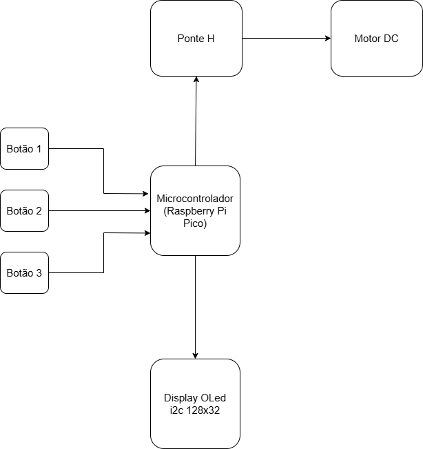

# 🃏 Card Shuffler - Embaralhador de Cartas Motorizado e Inteligente

## Visão Geral do Projeto

Este projeto consiste no desenvolvimento de um embaralhador de cartas motorizado utilizando a placa de microcontrolador Raspberry Pi Pico[cite: 1]. O objetivo principal é automatizar o processo de embaralhamento de cartas, proporcionando uma experiência mais eficiente e justa em jogos[cite: 2].

O dispositivo é controlado por três botões, que permitem ao usuário selecionar diferentes opções de embaralhamento, correspondendo a tempos de rotação específicos do motor e relacionados à quantidade de cartas utilizadas[cite: 3]. Um display OLED é integrado para fornecer feedback visual em tempo real, informando sobre a opção selecionada e o progresso do processo (contagem regressiva)[cite: 4, 5].

O foco é a utilização de módulos de fácil acesso e baixo custo, tornando o projeto replicável e acessível para entusiastas e jogadores[cite: 5].

## Funcionalidades e Requisitos (Requisitos do Sistema)

O sistema foi desenvolvido para atender aos seguintes requisitos[cite: 6]:

* **UR-01:** Ser composto por módulos prontos de fácil acesso.
* **UR-02:** Possuir um motor DC para realizar o embaralhamento das cartas.
* **UR-03:** Permitir a seleção de 3 opções de tempo de embaralhamento através de botões.
* **UR-04:** Utilizar um display OLED para feedback visual ao usuário.
* **UR-05:** Exibir no display OLED a opção de embaralhamento selecionada e o tempo restante do processo.
* **UR-06:** O display OLED deve mostrar um texto "embaralhando" enquanto o motor estiver ativo.
* **UR-07:** O display OLED deve mostrar as opções de cartas (ex: "1:40 2:52 3:104") quando o motor estiver parado.
* **UR-08:** Possuir uma interface de usuário simples e intuitiva (botões e display).
* **UR-09:** Possuir bateria externa para praticidade. (Desejável)

## Como Funciona

O usuário interage com o embaralhador através de três botões. Cada botão é pré-configurado para um tempo específico de embaralhamento, o que pode corresponder a diferentes quantidades de cartas (ex: 40, 52, 104 cartas)[cite: 6]. Ao pressionar um botão, o motor DC é acionado pela Ponte H e gira pelo tempo determinado. Durante o embaralhamento, o display OLED mostra a mensagem "EMBARALHANDO" e uma contagem regressiva. Quando o motor está parado, o display OLED indica as opções de cartas para cada botão[cite: 6].

## Componentes Principais

* **Microcontrolador:** Raspberry Pi Pico
* **Motor:** Motor DC
* **Driver de Motor:** Ponte H (L298N ou similar)
* **Interface de Usuário:** 3x Botões Push-Button
* **Display:** Display OLED I2C (128x32 ou 128x64 pixels)
* **Alimentação:** Fonte de Alimentação Externa para o motor (e opcionalmente bateria externa para praticidade [cite: 6])

## Diagrama de Blocos do Sistema

